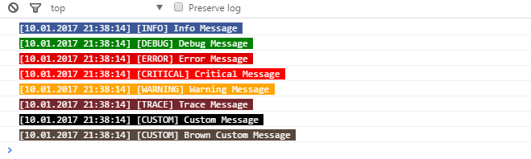

# ColorLog.js

Make your logs more fun.

[JSFiddle Sample](https://jsfiddle.net/aligoren/yLry9nf6/)



## Usage

```js
let logger = new Log();
logger.Info("Info Message")
logger.Debug("Debug Message")
logger.Error("Error Message")
logger.Critical("Critical Message")
logger.Warning("Warning Message")
logger.Trace("Trace Message")
logger.Custom("Custom Message", "CUSTOM", "#000", "#fff")
logger.Custom("Brown Custom Message", "CUSTOM", "#58473C", "#fff") 

/* first: background, second: text color */
```

## ColorLog.js

Loglarınızı daha eğlenceli hale getirin.

### Kullanım

Sınıfı ilgili alana dahil ettikten sonra aşağıdaki şekillerde kullanım gerçekleştirebilirsiniz.

```js
let logger = new Log();
logger.Info("Info Message")
logger.Debug("Debug Message")
logger.Error("Error Message")
logger.Critical("Critical Message")
logger.Warning("Warning Message")
logger.Trace("Trace Message")
logger.Custom("Custom Message", "CUSTOM", "#000", "#fff")
logger.Custom("Brown Custom Message", "CUSTOM", "#58473C", "#fff") 

/* ilk hex kodu arkaplan rengi, ikincisi yazı rengi */
```
